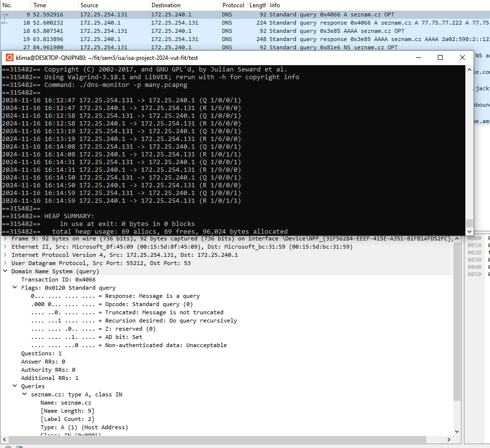
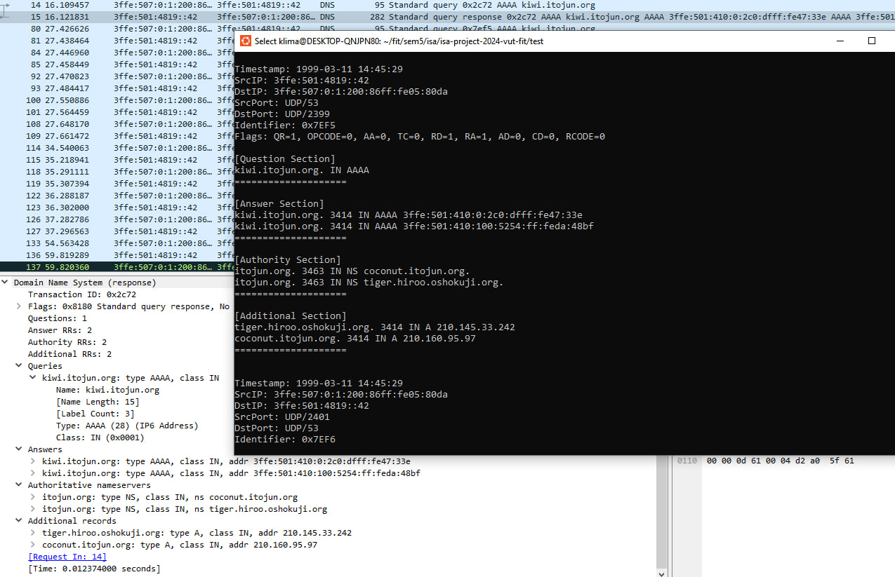

Documentation of Project 1 **Monitoring DNS communication** variant for ISA 2024/2025 

Name and surname: **Andrii Klymenko** 

Login: **xklyme00** 

## 1    Introduciton

DNS is one of the most important services on the Internet.
People use it dozens of times every day without even realizing it:
when they visit a website (through domain names, like apple.com or eshop.notime),
when they send e-mails, etc.
In order to understand how this service works, what are its features,
I decided to implement a program that will monitor DNS communication and process it - DNS monitor.

## 2    Theory

In this chapter there is presented the basic information that was necessary to study before implementing the project.

### 2.1    Domain Name System

DNS (Domain Name System) is a critical system for translating human-readable
domain names (like www.example.com) into IP addresses (like 93.184.216.34)
that computers use to communicate over the internet. Often called the
"phone book of the internet," DNS helps users reach websites and online
resources by resolving domain names to their respective IP addresses.

#### 2.1.1    How does DNS work

When you type a URL in your browser, your device queries the DNS system to find the IP address associated with that domain.
The request goes to a DNS resolver (usually provided by your ISP or a third party like Google or Cloudflare), which begins the process of finding the IP address by querying various DNS servers.
The resolver first contacts a root name server. Root servers are the entry points to the DNS hierarchy and direct requests to the correct Top-Level Domain (TLD) servers based on the domain's suffix (e.g., .com, .org, .net).
TLD servers handle requests for each top-level domain and direct the resolver to the authoritative name server for the domain, which stores the actual IP address and other DNS records.
The authoritative server provides the IP address for the requested domain. This information is then sent back to the resolver and cached to speed up future requests for the same domain.
The resolver returns the IP address to your device, which can now establish a direct connection to the server hosting the desired website.

#### 2.1.2    Uses of DNS

- Resolving domain names for web browsing.
- Using MX records to direct email traffic.
- Content Delivery Networks use DNS to distribute user requests to the nearest server, improving load times.
- DNS can distribute requests across multiple servers to balance load and prevent overload on any single server.

### 2.2    DNS record types

There exist many types of the DNS records (which can be viewed here: https://www.iana.org/assignments/dns-parameters/dns-parameters.xhtml#dns-parameters-4).
However, the project's assignment demanded only support of the next seven DNS record types:
- A
- AAAA
- SRV
- SOA
- MX
- CNAME
- NS

Therefore, only these types of records will be described below.

#### 2.2.1    A Record (Address Record)

Maps a domain name to an IPv4 address. If you query the **A** record for _example.com_, it might return _93.184.216.34_.
Primarily used to point domain names to servers hosting websites or other internet services.

#### 2.2.2    AAAA Record (IPv6 Address Record)

Maps a domain name to an IPv6 address. If you query the **AAAA** record for _example.com_, it might return _2606:2800:220:1:248:1893:25c8:1946_.
The usage is similar to an A record but for IPv6 addresses, supporting the newer IPv6 addressing scheme.

#### 2.2.3    MX Record (Mail Exchange Record)

Directs email to a mail server associated with the domain. An **MX** record for _example.com_ might point to _mail.example.com_ with a priority value.
The priority value determines which server should be used first. Lower values indicate higher priority. These records are essential for setting up email services.

#### 2.2.4    SOA Record (Start of Authority)

Contains administrative information about a DNS zone.
It has the primary name server, the email of the domain administrator, and timers related to zone refresh intervals.
Every DNS zone must have an SOA record, which defines the primary authoritative server and settings for managing DNS updates and caching.

#### 2.2.5    NS Record (Name Server Record)

Specifies the authoritative name servers for a domain.
An NS record for _example.com_ could point to _ns1.example.com_ and _ns2.example.com_.
Indicates which servers hold the authoritative records for a domain, allowing DNS resolvers to reach the correct servers to answer queries for that domain.

#### 2.2.6    SRV Record (Service Record)

Specifies a service’s location by defining the hostname and port number.
Includes priority, weight, port, and target, allowing for load balancing and prioritization.
Commonly used for services like VoIP, XMPP (Jabber), and other protocols that require a specific host and port to connect.

#### 2.2.7    CNAME Record (Canonical Name Record)

Maps one domain name to another, essentially creating an alias.
If www.example.com has a CNAME pointing to example.com, it means that accessing www.example.com will retrieve records for example.com.
Useful for pointing multiple domain names to a single IP without needing to update every domain’s A record. CNAMEs allow a single host to have multiple names that all refer to the same resource.

## 3    Implementation design

According to the project's assignment, there are 2 kinds of program's output on 
**stdout**: simple and verbose. So I have created an abstract class _Packet_writer_
and two classes _Simple_packet_writer_ and _Verbose_packet_writer_. Until the
DNS packet's question section, these two classes process a packet similarly,
except they are providing different type of output. When a _Simple_packet_writer_
reaches DNS packet's question section, next it only processes domain names and their
translations if needed, ignoring all kinds of another records information.
On the other hand, _Verbose_packet_writer_ retrieves and outputs all information
about each record.

## 4    Testing

I have created multiple **pcap** and **pcapng** files that contain DNS queries and
responses of all types that my program is supposed to support and compared
program's output to these files, and the result was the same. I opened these files
using Wireshark program (https://www.wireshark.org/). The program properly
handles memory access, allocation and deallocation so there must not be any memory leaks
or any another kind of memory manipulation problems.
I have used Valgrind program (https://valgrind.org/) for memory debugging and leak detection.
I have also tested my program
in the reference development environment (i.e. school servers **Eva** and **Merlin**).
Below there are 2 examples of the comparison of the program's and Wireshark's output.

### Bibliography

1. **RFC 2782 - A DNS RR for specifying the location of services (DNS SRV)**. Internet Engineering Task Force (IETF). Available at: [https://datatracker.ietf.org/doc/html/rfc2782](https://datatracker.ietf.org/doc/html/rfc2782).

2. **DNS Parameters - Resource Record (RR) TYPEs**. Internet Assigned Numbers Authority (IANA). Available at: [https://www.iana.org/assignments/dns-parameters/dns-parameters.xhtml#dns-parameters-2](https://www.iana.org/assignments/dns-parameters/dns-parameters.xhtml#dns-parameters-2).

3. **RFC 1035 - Domain Names - Implementation and Specification**. Internet Engineering Task Force (IETF). Available at: [https://datatracker.ietf.org/doc/html/rfc1035](https://datatracker.ietf.org/doc/html/rfc1035).

4. **RFC 3596 - DNS Extensions to Support IP Version 6**. Internet Engineering Task Force (IETF). Available at: [https://datatracker.ietf.org/doc/html/rfc3596#page-2](https://datatracker.ietf.org/doc/html/rfc3596#page-2).

5. **RFC 2065 - Domain Name System Security Extensions**. Internet Engineering Task Force (IETF). Available at: [https://datatracker.ietf.org/doc/html/rfc2065#page-30](https://datatracker.ietf.org/doc/html/rfc2065#page-30).

6. **Matoušek, P.** *Síťové aplikace a jejich architektura*. VUTIUM, 2014.

7. **Project 1 Primer - DNS and HTTP**. Mislove.org. Available at: [https://mislove.org/teaching/cs4700/spring11/handouts/project1-primer.pdf](https://mislove.org/teaching/cs4700/spring11/handouts/project1-primer.pdf).
